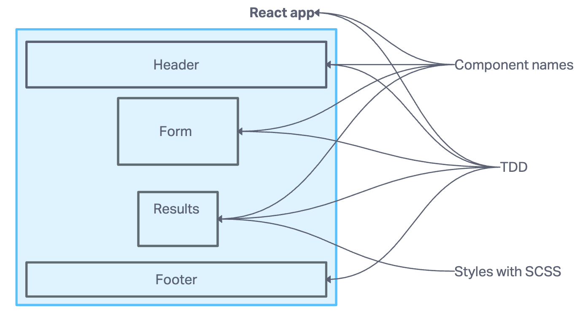
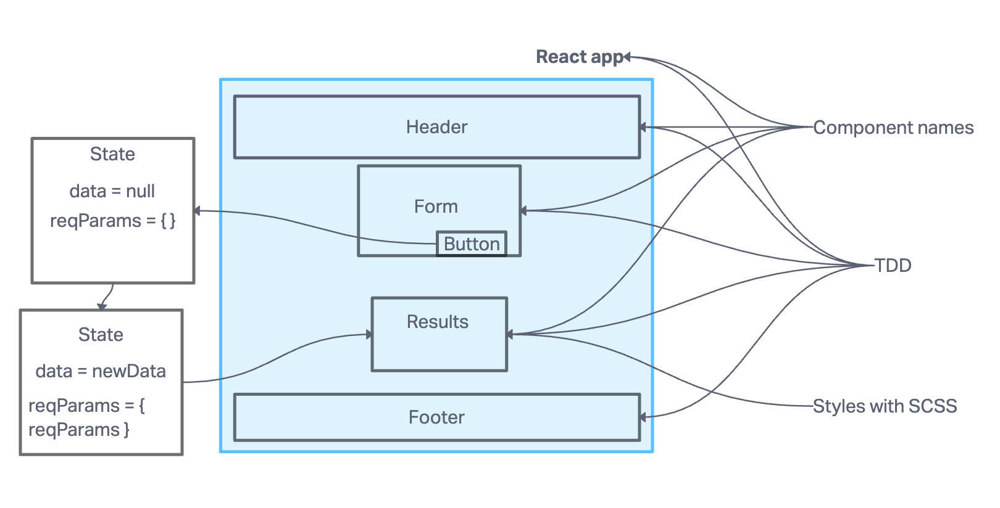

# Component Based UI Project

## Author: Tricia Sawyer

This React-based project explores various aspects of modern web development and user interface design. It consists of several phases, each building upon the previous one to create a robust web application.

### Key Concepts Explored

#### Phase 1: Component Architecture and React Basics

- Dive into the world of web design with SASS, utilizing nesting and variables.
- Explore the concept of "Component Architecture" for building modular and maintainable UIs.
- Understand the importance of managing application and component state.
- Get acquainted with the fundamental structure of a React application, including the role of index.html and index.js.
- Discover how React renders content into a designated root element and learn about JSX, which blends JavaScript with markup.
- Explore the flexibility of React components, which can be implemented as classes or functions, and understand how what's returned gets rendered.
- Grasp the concept that components can load and render other components, promoting code reusability.
- Experience the ability of components to manage their own CSS styles.

#### Phase 2: Refactoring with React Hooks

- Refactor components that use the legacy this.setState() method to employ the modern useState() React API hook.
- Enhance the Form Component to handle user input from form elements, eliminating hard-coded string values.

#### Phase 3: Connecting to Live APIs

In this phase, the project shifts its focus to connecting with live APIs, fetching remote data, and presenting it to users. It implements the ability for users to enter API URLs and issue GET requests to retrieve data. It also provides users with readable and well-formatted results from API requests.

#### Phase 4: API Call Tracking

In the final phase, I added a feature to track and store every API call in a history. Users can easily access a list of their previous API calls to review results quickly.

### Deployment

[Code sandbox](https://6nlgfl-3000.csb.app/)

### Collaborators

- ChatGPT provided guidance on getting started and assisting with writing tests.
- Collaboration with Ryan Gallaway contributed to project improvements

### Project Setup

1. Initiate a local React project using create-react-app.
2. Utilize Codesandbox.io for live development on a React application.
3. Create and render both Class and Functional React components to the DOM.
4. Add event listeners to React components for interactivity.
5. Update React component state to reflect changes in the UI.
6. Style React applications and components using SASS for enhanced aesthetics.
7. Running the Application, to start the application, use the command `npm start`.
8. Execute tests with the command `npm test`.

#### UML

