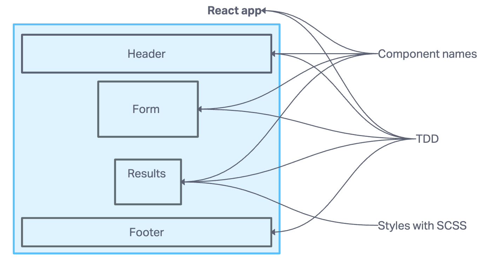

# Project: Lab 26 - Component Based UI

This project was bootstrapped with [Create React App](https://github.com/facebook/create-react-app).

## Author: Tricia Sawyer

## Project domain

- SASS - Nesting and Variables
- "Component Architecture"
- Application and Component "State"
- Debate/Discuss Libraries vs Frameworks
- Basics of a React App
  - index.html in public (root div)
  - index.js as an untouchable "bootstrap" or "entry point"
  - React Renders into that div
  - JSX is actually javascript but it looks like markup
  - Components can be classes or functions. What gets "returned" gets "rendered"
    - Class - `render() { return(jsx) }`
    - Function - `return(jsx)`
  - Components can load and render each other
  - Components can load their own css

### Collaborators

Used ChatGPT to help me understand what the assignment was asking for, as well as writing tests

### Setup

- Begin a React project locally with `create-react-app`
- Use codesandbox.io to work live on a React application
- Create and render `Class` and `Functional` React components to the DOM
- Add event listeners to React components
- Update React component state
- Style React applications/components using SASS

#### `.env` requirements (where applicable)

Does not require .env file as of right now

#### How to initialize/run your application (where applicable)

- e.g. `npm start`

#### How to use your library (where applicable)

#### Features / Routes

- Feature One: Details of feature
- GET : `/hello` - specific route to hit

#### Tests

- npm test

#### UML

### Live/Deployment

[Code sandbox](https://smhqkn-3000.csb.app)
